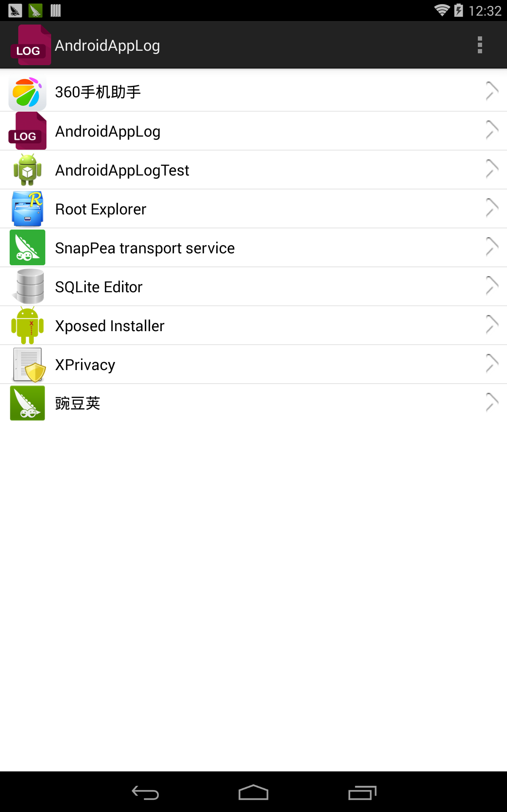
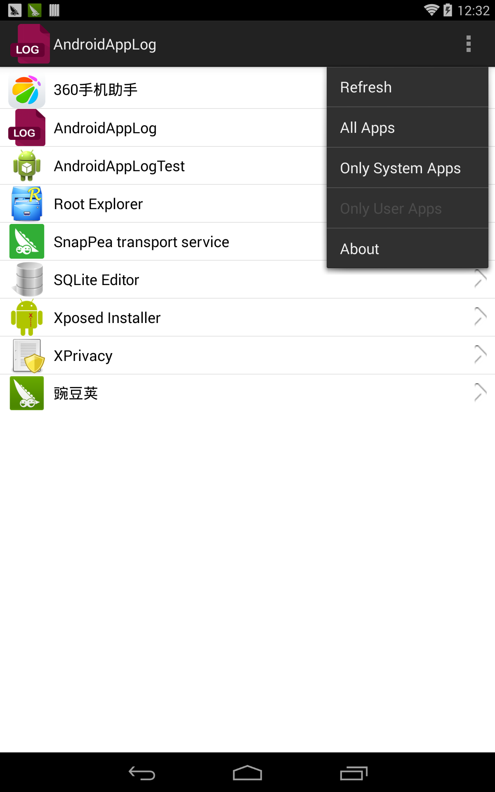
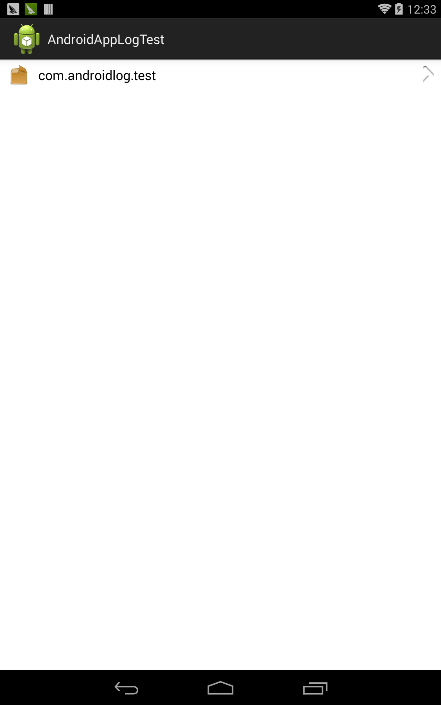
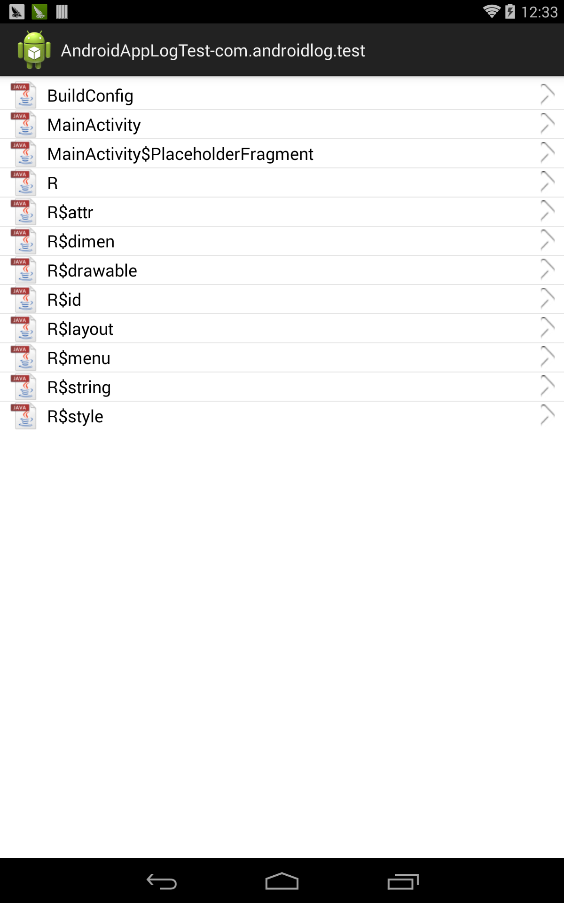
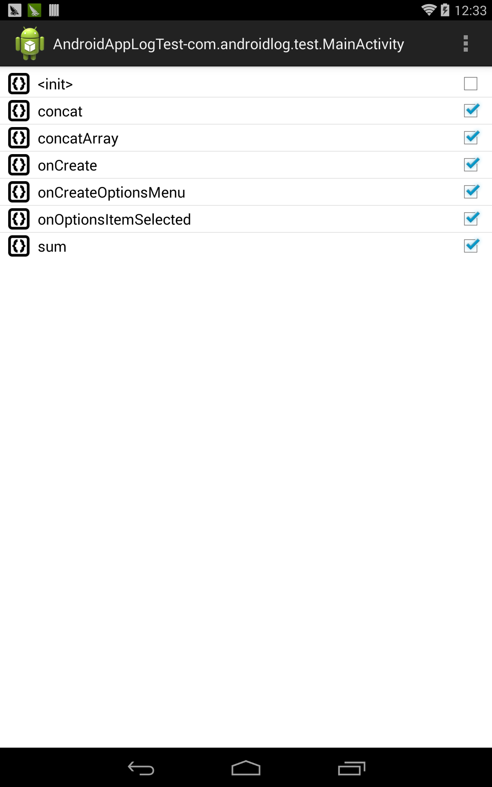
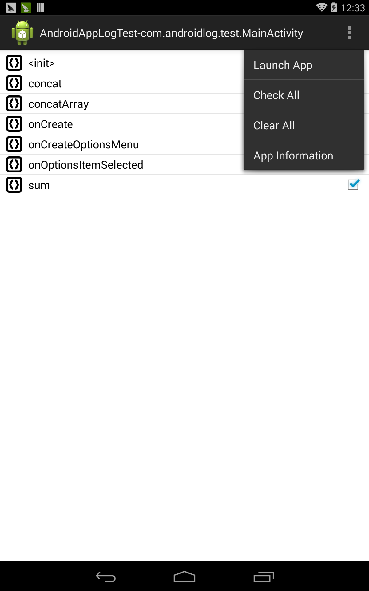
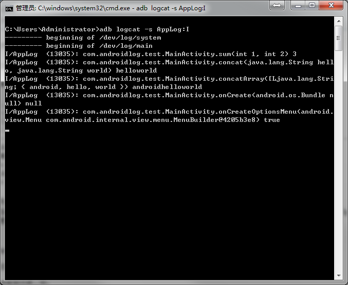

AndroidAppLog
==============

A tool to log method's parameters and return value. 

Currently, AndroidAppLog can only parse a variable whose type is primitive, string or one dimension array which consist of primitive type or string. For other object instances, AndroidAppLog will call the *toString* method to record the variables' value.

Usage
-------------
**Using AndroidAppLog is entirely at your own risk**

AndroidAppLog is built based on [Xposed framework](https://github.com/rovo89/XposedBridge), you need to install the [Xposed Installer](http://repo.xposed.info/module/de.robv.android.xposed.installer) before using AndroidAppLog.

On the main activity of AndroidAppLog, after clicking the *application's name*, you will see all the packages contained in the application you chose. Classes will be listed when you click each **package name(not the app icon)**. Continue clicking the *class name** you will finally see all the methods and you can check the methods you want to log. *Whenever you change the methods you need to log, please ensure to reboot your device*(I know it brings  inconvenience while it will cause lots of *GCs(Garbage Collection)* and will result in application's no response when hook all the methods in a certain application at one time. I haven't found an elegant way to figure out this problem. So just be patient with AndroidAppLog).

You can use the command below to see all the log records:
```
	adb logcat -s AppLog:I
```

Each log record is formatted as: *class.method(variable-type variable-value, ...) return-type return-value*. You can refer to the last graph to see the log results.










License
------------
AndroidAppLog is licensed under the GNU General Public License v3.0 [GNU General Public License version 3](http://www.gnu.org/licenses/gpl.txt)
